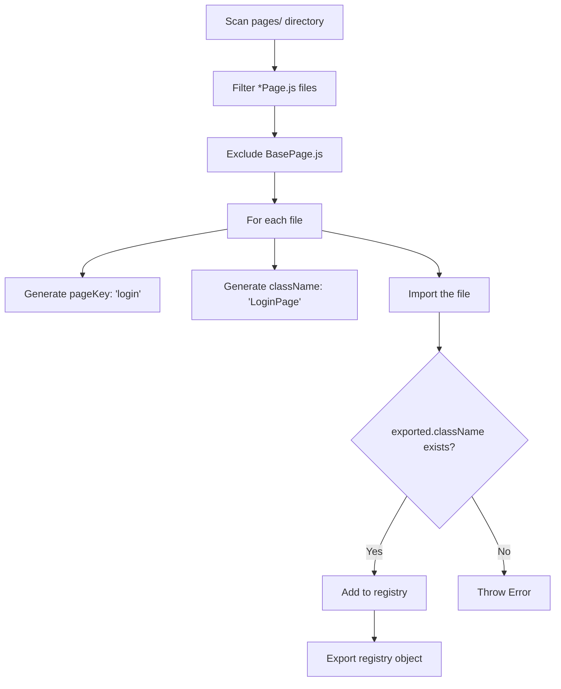

# Page Registry Documentation

## Overview

The `pageRegistry.js` module is an **auto-discovery system** that dynamically registers all Page Object classes in the framework. It scans the `pages/` directory at startup, extracts page classes, and creates a registry mapping that connects Gherkin feature files to Page Object instances.

## File Location

```
project/
├── Support/
│   └── pageRegistry.js    ← This file
├── pages/
│   ├── BasePage.js        ← Excluded from registry
│   ├── LoginPage.js       ← Auto-registered
│   └── ShopPage.js        ← Auto-registered
```

## Purpose

| Goal | Description |
|------|-------------|
| **Auto-discovery** | No manual registration needed when adding new pages |
| **Decoupling** | Step definitions reference pages by string, not imports |
| **Consistency** | Enforces naming conventions across the framework |
| **Fail-fast** | Validates exports at startup, not during test execution |

## How It Works



## Code Breakdown

### Complete Source Code

```javascript
const fs = require('fs');
const path = require('path');

const pagesDir = path.join(__dirname, '../pages');
const registry = {};

const files = fs.readdirSync(pagesDir);

for (const file of files) {
    if (file.endsWith('Page.js') && file !== 'BasePage.js') {
        const fullPath = path.join(pagesDir, file);
        const pageKey = file.replace('Page.js', '').toLowerCase();
        const className = file.replace('.js', '');
        const exported = require(fullPath);
        
        if (!exported[className]) {
            throw new Error(
                `${file} must export { ${className} }`
            );
        }
        
        registry[pageKey] = exported[className];
    }
}

module.exports = registry;
```

### Line-by-Line Explanation

**Imports:**
```javascript
const fs = require('fs');
const path = require('path');
```
Node.js built-in modules for file system operations and path manipulation.

**Directory Path:**
```javascript
const pagesDir = path.join(__dirname, '../pages');
```
Creates absolute path to the `pages/` folder relative to this file's location.

| Variable | Example Value |
|----------|---------------|
| `__dirname` | `/project/Support` |
| `pagesDir` | `/project/pages` |

**Read Directory:**
```javascript
const files = fs.readdirSync(pagesDir);
```
Synchronously reads all filenames in the pages directory.

```javascript
// Example result:
['BasePage.js', 'LoginPage.js', 'ShopPage.js']
```

**File Filter:**
```javascript
if (file.endsWith('Page.js') && file !== 'BasePage.js')
```

| Filename | `endsWith('Page.js')` | `!== 'BasePage.js'` | Included? |
|----------|----------------------|---------------------|-----------|
| `BasePage.js` | ✓ | ✗ | No |
| `LoginPage.js` | ✓ | ✓ | Yes |
| `ShopPage.js` | ✓ | ✓ | Yes |
| `helpers.js` | ✗ | ✓ | No |

**Key Generation:**
```javascript
const pageKey = file.replace('Page.js', '').toLowerCase();
const className = file.replace('.js', '');
```

| Filename | pageKey | className |
|----------|---------|-----------|
| `LoginPage.js` | `login` | `LoginPage` |
| `ShopPage.js` | `shop` | `ShopPage` |
| `UserProfilePage.js` | `userprofile` | `UserProfilePage` |

**Import and Validate:**
```javascript
const exported = require(fullPath);

if (!exported[className]) {
    throw new Error(`${file} must export { ${className} }`);
}
```
Imports the page file and validates the expected class exists in exports.

**Register:**
```javascript
registry[pageKey] = exported[className];
```
Stores the page class in the registry object.

## Final Output

The registry exports an object mapping pageKeys to Page classes:

```javascript
{
    "login": [class LoginPage],
    "shop": [class ShopPage]
}
```

## Integration with Framework

### Connection Flow


### How Gherkin Connects to Pages

**Step 1: Feature File**
```gherkin
Given the user navigates to the "login" page
```

**Step 2: Step Definition**
```javascript
Given('the user navigates to the {string} page', async ({ pageObjects }, pageName) => {
    const pageObject = pageObjects[pageName + "Page"];
    // pageObjects["loginPage"]
});
```

**Step 3: PageFactory**
```javascript
getAll() {
    const all = {};
    for (const key of Object.keys(pageRegistry)) {
        all[key + 'Page'] = this.get(key);
        // all["loginPage"] = LoginPage instance
    }
    return all;
}
```

**Step 4: Registry Lookup**
```javascript
get(pageKey) {
    const PageClass = pageRegistry[pageKey];
    // pageRegistry["login"] → LoginPage class
    return new PageClass(this.page);
}
```

## Naming Conventions

### Required Page File Structure

```javascript
// Filename: LoginPage.js

const { BasePage } = require('./BasePage');

class LoginPage extends BasePage {
    constructor(page) {
        super(page, 'https://example.com/login');
    }
}

module.exports = { LoginPage };  // Must match filename
```

### Convention Rules

| Rule | Correct | Incorrect |
|------|---------|-----------|
| Filename suffix | `LoginPage.js` | `Login.js` |
| Export name matches filename | `{ LoginPage }` | `{ Login }` |
| Class extends BasePage | `class LoginPage extends BasePage` | `class LoginPage` |
| Single page class per file | One class | Multiple classes |

## Error Handling

### Validation Errors

**Typo in Export:**
```javascript
// LoginPage.js
module.exports = { LogniPage };  // Typo!
```
```
Error: LoginPage.js must export { LoginPage }
```

**Missing Export:**
```javascript
// LoginPage.js
module.exports = { };  // Empty!
```
```
Error: LoginPage.js must export { LoginPage }
```

**Wrong Export Name:**
```javascript
// LoginPage.js
module.exports = { Login };  // Missing "Page" suffix
```
```
Error: LoginPage.js must export { LoginPage }
```

### Runtime Errors (in PageFactory)

**Unknown Page Requested:**
```javascript
pageFactory.get('unknown');
```
```
Error: Unknown page: unknown
```

## Safety Features

| Concern | How It's Handled |
|---------|------------------|
| Helper functions in exports | Ignored — only looks for `exported[className]` |
| Export order dependency | None — uses filename-derived className |
| Typo in export name | Caught at startup with clear error |
| Missing export | Caught at startup with clear error |
| Non-page files in directory | Filtered out by `endsWith('Page.js')` |
| BasePage registration | Explicitly excluded |

### Example: Helpers Are Ignored

```javascript
// LoginPage.js
const helper = () => { /* ... */ };

class LoginPage extends BasePage { /* ... */ }

module.exports = { 
    helper,      // ← Ignored by registry
    LoginPage    // ← Registered
};
```

The registry explicitly looks for `exported["LoginPage"]`, so other exports don't interfere.

## Adding a New Page

**Step 1:** Create the page file following naming convention:

```javascript
// pages/CheckoutPage.js
const { BasePage } = require('./BasePage');

class CheckoutPage extends BasePage {
    constructor(page) {
        super(page, 'https://example.com/checkout');
    }
}

module.exports = { CheckoutPage };
```

**Step 2:** Use it in Gherkin:

```gherkin
Given the user navigates to the "checkout" page
```

No changes needed to `pageRegistry.js`, `PageFactory.js`, or step definitions.

## Quick Reference

### Input → Output Transformation

| Input File | pageKey | className | Registry Entry |
|------------|---------|-----------|----------------|
| `LoginPage.js` | `login` | `LoginPage` | `registry["login"] = LoginPage` |
| `ShopPage.js` | `shop` | `ShopPage` | `registry["shop"] = ShopPage` |
| `UserProfilePage.js` | `userprofile` | `UserProfilePage` | `registry["userprofile"] = UserProfilePage` |

### Gherkin → Class Mapping

| Gherkin String | pageObjects Key | Registry Key | Class |
|----------------|-----------------|--------------|-------|
| `"login"` | `loginPage` | `login` | `LoginPage` |
| `"shop"` | `shopPage` | `shop` | `ShopPage` |
| `"userprofile"` | `userprofilePage` | `userprofile` | `UserProfilePage` |

## Troubleshooting

| Problem | Cause | Solution |
|---------|-------|----------|
| `Unknown page: xyz` | Page file doesn't exist or wrong filename | Create `XyzPage.js` in `pages/` |
| `must export { XyzPage }` | Export doesn't match filename | Fix export: `module.exports = { XyzPage }` |
| Page not being registered | Filename doesn't end with `Page.js` | Rename file to `XyzPage.js` |
| `Cannot read property 'navigate'` | pageKey mismatch in Gherkin | Check spelling in feature file |